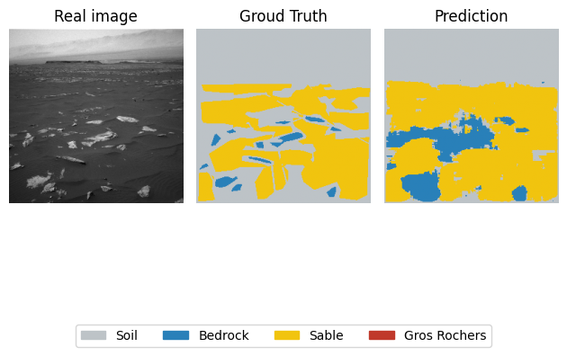
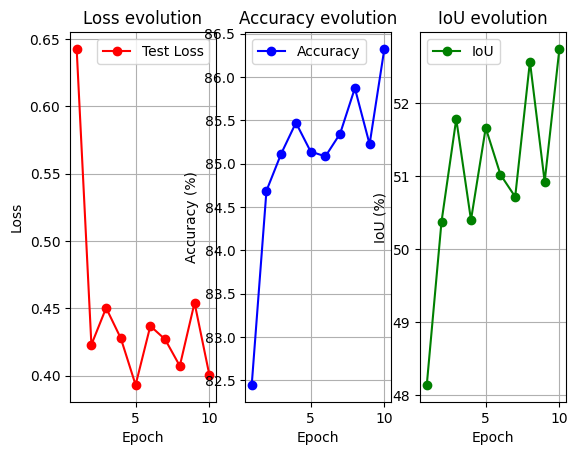
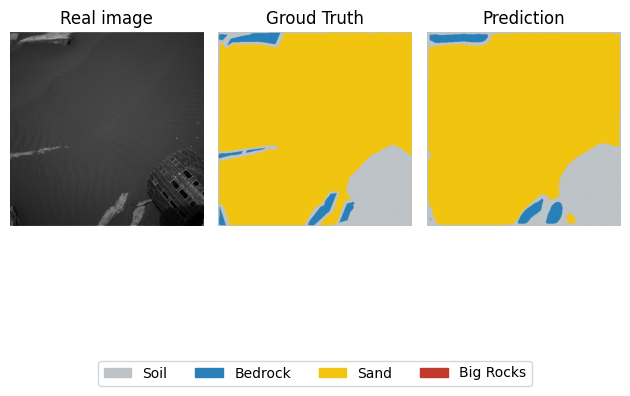
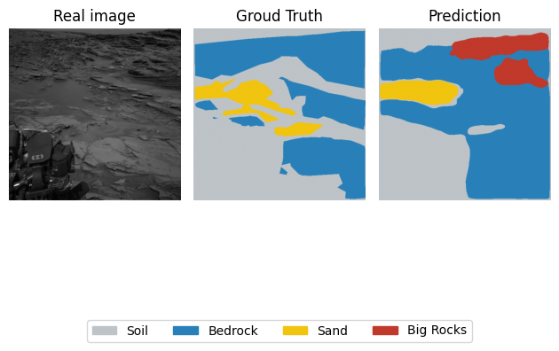

# 🚀 Mars Rover Vision (Terrain Segmentation)

## 📄 Overview

This project is a Computer Vision application designed to assist Mars Rovers in autonomous navigation. The goal is to analyze images from the rover's camera and classify each pixel to identify safe terrain (soil) versus obstacles (big rocks).

I built a **Semantic Segmentation** model using a custom **U-Net architecture** from scratch in PyTorch.

## 🎯 Objective

The AI must classify each pixel of the Mars surface into 4 categories:
1.  **Soil** (Safe to drive)
2.  **Bedrock** (Stable rock)
3.  **Sand** (Risk of getting stuck)
4.  **Big Rocks** (Dangerous obstacles)

## 🛠️ Features
I used the **AI4Mars Dataset** provided by NASA/JPL.
* **Source:** [Kaggle - AI4Mars Dataset](https://www.kaggle.com/datasets/yash92328/ai4mars-terrainaware-autonomous-driving-on-mars)
* **Input:** Grayscale images from the rover's navigation cameras.
* **Labels:** Masks annotated by experts.

## 📦 Requirements
To run this code, you need Python installed with the following libraries:
```bash
pip install torch torchvision opencv-python matplotlib scikit-learn numpy segmentation-models-pytorch
```

## METHOD 1 :

### 🧠 Model Architecure

* **Architecture:** Custom **U-Net** (coded layer by layer).
* **Optimization:**
    * **Data Augmentation:** Random horizontal and vertical flips to prevent overfitting.
    * **Class Weights:** The dataset has a lot of "Soil" but few "Big Rocks". I penalized the model more when it misses rocks to balance the learning.
    * **Learning Rate Scheduler:** Used `ReduceLROnPlateau` to adjust learning speed dynamically.
    * **Metric:** Calculated **mIoU** (Mean Intersection over Union) for a realistic evaluation.

### 📊 Results & Analysis

After training for 10 epochs on the Google Collab GPU T4, the model achieved the following performance on the Test set:


| Metric | Score |
| :--- | :--- |
| **Global Accuracy** | **~83.6%** |
| **Mean IoU (mIoU)** | **~49.0%** |

1.  **Global Performance:** The model learns the general structure of the terrain well because it correctly separates the sky/background from the ground.
2.  **Limitations:** Visually, the predictions are a bit "blocky" because the input resolution is low (128x128).
3.  **Confusion:** The model sometimes "hallucinates" Bedrock (Blue) in the middle of Sand (Yellow).

#### Some examples of prediction :
  
  

## METHOD 2 :

### 🧠 Model Architecture

* **Architecture:** U-Net with a **ResNet34** encoder.
* **Pre-training:** The encoder was pre-trained on **ImageNet**.
* **Key Improvements:** Increased input size from 128x128 to **512x512**. Small rocks are now visible.

### 📊 Results & Analysis

After training for 10 epochs on the Google Collab GPU T4, the model achieved the following performance on the Test set:



| Metric | Score |
| :--- | :--- |
| **Global Accuracy** | **~85.0%** |
| **Mean IoU (mIoU)** | **~52.5%** |

1.  **Visual Quality:** Thanks to the 512x512 resolution, the borders of the rocks are sharper and less "blocky" than in Method 1.
2.  **The "Rover" Issue:** Both models sometimes confuse the metallic parts of the Rover with rocks. This is expected because the Rover is not a natural element.
3.  **Performance Context:** A mIoU of ~55% might seem low compared to other domains, but for the AI4Mars dataset (which is very difficult and unstructured), the "State of the Art" ("SegMarsViT" (2022)) is around 68%. Achieving 52% is a good result for this project.

#### Some examples of prediction:


