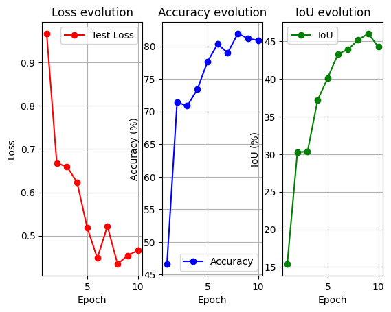
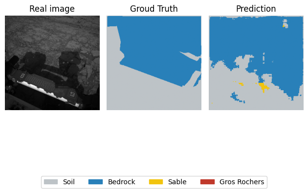

# 🚀 Mars Rover Vision (Terrain Segmentation)

## 📄 Overview

This project is a Computer Vision application designed to assist Mars Rovers in autonomous navigation. The goal is to analyze images from the rover's camera and classify each pixel to identify safe terrain (soil) versus obstacles (big rocks).

I built a **Semantic Segmentation** model using a custom **U-Net architecture** from scratch in PyTorch.

## 🎯 Objective

The AI must classify each pixel of the Mars surface into 4 categories:
1.  **Soil** (Safe to drive)
2.  **Bedrock** (Stable rock)
3.  **Sand** (Risk of getting stuck)
4.  **Big Rocks** (Dangerous obstacles)

## 🛠️ Features
I used the **AI4Mars Dataset** provided by NASA/JPL.
* **Source:** [Kaggle - AI4Mars Dataset](https://www.kaggle.com/datasets/yash92328/ai4mars-terrainaware-autonomous-driving-on-mars)
* **Input:** Grayscale images from the rover's navigation cameras.
* **Labels:** Masks annotated by experts.

## 📦 Requirements
To run this code, you need Python installed with the following libraries:
```bash
pip install torch torchvision opencv-python matplotlib scikit-learn numpy
```

## 🧠 Model Architecure
* **Architecture:** Custom **U-Net** (coded layer by layer).
* **Optimization:**
    * **Data Augmentation:** Random horizontal and vertical flips to prevent overfitting.
    * **Class Weights:** The dataset has a lot of "Soil" but few "Big Rocks". I penalized the model more when it misses rocks to balance the learning.
    * **Learning Rate Scheduler:** Used `ReduceLROnPlateau` to adjust learning speed dynamically.
    * **Metric:** Calculated **mIoU** (Mean Intersection over Union) for a realistic evaluation.

## 📊 Results & Analysis

After training for 10 epochs on the Google Collab GPU T4, the model achieved the following performance on the Test set:



| Metric | Score |
| :--- | :--- |
| **Global Accuracy** | **~83.6%** |
| **Mean IoU (mIoU)** | **~49.0%** |

To improve the mIoU score, I plan to:
* **Transfer Learning:** Replace the custom encoder with a pre-trained ResNet34.
* **Higher Resolution:** Increase input size from 128x128 to 512x512.


### Some examples of prediction :
  
  
